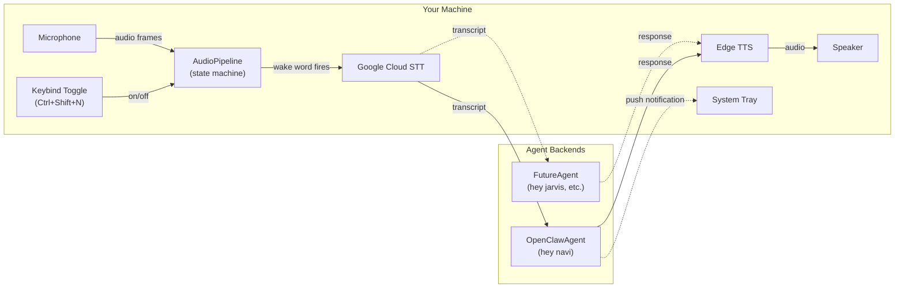
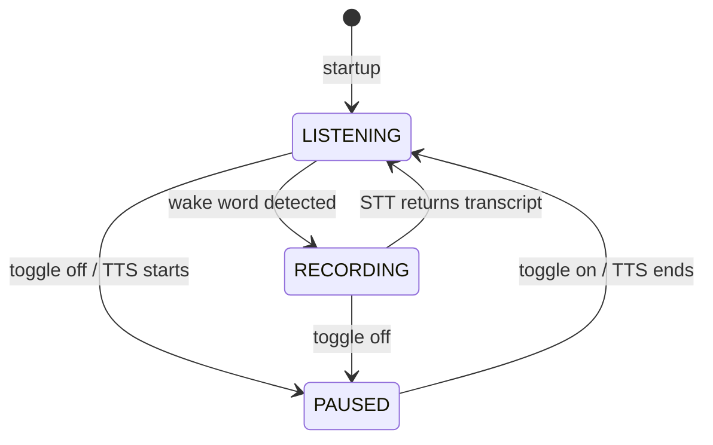

# Dispatch

[](https://python.org)
[](tests/)
[](LICENSE)

**Dispatch** is a modular voice-first command channel for AI agents. Say a wake word, speak a command, hear the response -- and hear from your agents when *they* have something to say.

Communication is **bidirectional**. You talk to agents through wake words and voice commands, and agents talk back to you through proactive voice notifications -- alerts, reminders, status updates -- spoken aloud without you asking first. Dispatch registers as a voice-capable device on each agent's gateway, so the agent can push a message to your speakers at any time.

Think "air traffic control for AI": each wake word routes to a different agent backend. Dispatch handles the full voice pipeline -- wake word detection, speech-to-text, agent routing, text-to-speech, and inbound push delivery -- so your agents just send and receive text.

[Architecture](#architecture) | [Configuration](#configuration-reference) | [Adding agents](#adding-a-new-agent)

> **Safety note:** Agents can speak to you unprompted. Proactive messages are queued and played sequentially -- they never overlap with active conversations or each other. Each notification announces the agent name first ("Navi says: ...") so you always know who is talking and why. All voice output goes through Edge TTS with the agent's configured voice; agents cannot execute commands on your machine or access your microphone.

> **Works offline out of the box.** Debug mode replaces all hardware and cloud dependencies with keyboard input. No microphone, no Picovoice account, no Google Cloud credentials needed to try it.

## Quick Start

```bash
# 1. Clone and install
git clone https://github.com/rauriemo/dispatch
cd dispatch
pip install -r requirements.txt

# 2. Try it immediately in debug mode (no accounts needed)
python -m dispatch --debug
```

**You're done when:**
1. You see `Dispatch started in debug mode` in the console
2. Press Enter to simulate a wake word detection
3. Type a command (e.g., `hello, what can you do?`)
4. Hear the agent's response spoken aloud via Edge TTS

```
[INFO] Dispatch started in debug mode
[INFO] Hotkey registered: <ctrl>+<shift>+n
[INFO] System tray active
Press Enter for wake word> 
[INFO] Wake word detected -> navi
Say something> hello, what can you do?
[INFO] Transcript: hello, what can you do?
[INFO] Navi responded (247 chars)
[INFO] Speaking response with voice en-US-AvaMultilingualNeural
```

Press `Ctrl+C` to stop. Dispatch disconnects all agents, releases audio resources, and exits cleanly.

## How It Works



1. **Toggle on** with a global hotkey -- microphone starts capturing
2. **Say a wake word** (e.g., "hey navi") -- Porcupine detects it locally, zero cloud calls
3. **Speak your command** -- audio streams to Google Cloud STT, transcript returned on silence
4. **Transcript routed to the matched agent** -- AgentRouter maps wake word index to the correct backend
5. **Response spoken aloud** -- Edge TTS generates audio in-memory, played through speakers
6. **Back to listening** -- ready for the next wake word

Agents can also **push proactive messages** to Dispatch via a second node WebSocket connection. Dispatch registers as a voice-capable device, so the agent can invoke `voice.speak` at any time. Urgent alerts interrupt idle listening; normal messages queue up and play sequentially.

## Features

- **Multi-agent routing**: different wake words route to different AI backends. Adding an agent is a config entry + one Python file.
- **Voice in, voice out**: full voice pipeline from wake word to spoken response. No typing required in live mode.
- **Always-on wake word**: Picovoice Porcupine runs entirely on-device (~1% CPU). No cloud calls until you speak.
- **Proactive voice push**: agents deliver unsolicited messages via a node WebSocket connection with `voice` capability. The gateway invokes `voice.speak` and Dispatch plays it through TTS. Priority queue with urgent/normal levels.
- **Per-agent voices**: each agent gets its own Edge TTS voice for instant recognition.
- **Debug mode**: keyboard-driven fallback (`--debug`) for the entire pipeline. Test everything without hardware or cloud accounts.
- **No audio on disk**: mic frames processed in-place, TTS output stays in BytesIO. Nothing saved.
- **System tray + hotkey**: toggle listening with a keybind, see status in the tray. Runs quietly in the background.
- **Graceful degradation**: if an agent is unreachable, Dispatch starts without it. If an agent fails mid-session, the error is spoken aloud and listening resumes.
- **Config-driven**: agents declared in YAML. Secrets in `.env`. Zero hardcoded endpoints or credentials.
- **Fully tested**: 60 tests covering config, routing, WebSocket gateway protocol, node invoke handling, state machine, audio conversion, TTS, notifications, and end-to-end debug flow. All offline, under 5 seconds.

## Prerequisites

| Dependency | Required for | Debug mode? |
|---|---|---|
| Python 3.11+ | Everything | Yes |
| [Picovoice account](https://console.picovoice.ai) | Wake word detection | No -- keyboard fallback |
| [Google Cloud STT](https://cloud.google.com/speech-to-text) | Speech-to-text | No -- typed input fallback |
| IAP tunnel to OpenClaw VM | Navi agent (WebSocket gateway) | No -- agent fails gracefully |
| Edge TTS | Voice responses | Yes (free, no account) |

## Going Live

After debug mode works, switch to real voice input:

```bash
# 1. Set up credentials in .env (copy from .env.example)
cp .env.example .env
# Edit .env with your actual keys:
#   PICOVOICE_ACCESS_KEY=your-access-key
#   OPENCLAW_TOKEN=your-gateway-token
#   GOOGLE_APPLICATION_CREDENTIALS=C:\path\to\service-account.json

# 2. Place your wake word model
# Train "hey navi" at console.picovoice.ai, download the .ppn file
cp hey-navi_en_windows.ppn assets/hey-navi.ppn

# 3. Start the IAP tunnel to your OpenClaw VM (separate terminal)
gcloud compute start-iap-tunnel openclaw-vm 18789 --local-host-port=localhost:18789 --zone=southamerica-east1-a

# 4. Run live (first run will require device pairing -- see below)
python -m dispatch
```

### First-Run Device Pairing

On first connect, OpenClaw requires device approval. Dispatch generates an Ed25519 keypair (stored in `.dispatch_device_key`) and the gateway returns a pairing request. You'll need to approve **twice** -- once for the operator role (chat) and once for the node role (voice push):

```bash
openclaw devices approve <requestId>
# or inside Docker:
docker exec -it <container> openclaw devices approve <requestId>
```

The request IDs are logged in Dispatch's output. After both approvals, the device is trusted for all future connects.

## Configuration Reference

### agents.yaml

```yaml
settings:
  hotkey: "<ctrl>+<shift>+n"    # pynput angle-bracket format
  audio_device: -1               # pvrecorder device index (-1 = system default)
  log_level: INFO                # DEBUG, INFO, WARNING, ERROR

agents:
  navi:
    type: openclaw
    wake_word: assets/hey-navi.ppn
    endpoint: http://localhost:18789
    token_env: OPENCLAW_TOKEN    # env var name, NOT the value
    voice: en-US-AvaMultilingualNeural
```

The `settings` block configures the system. Each agent entry specifies:

| Field | Purpose |
|---|---|
| `type` | Agent class to instantiate (matches the type registry) |
| `wake_word` | Path to Picovoice `.ppn` model file |
| `endpoint` | Agent API URL |
| `token_env` | Name of the env var holding the auth token |
| `voice` | Edge TTS voice ID for this agent's responses |

### .env

```bash
PICOVOICE_ACCESS_KEY=your-picovoice-access-key
OPENCLAW_TOKEN=your-openclaw-gateway-token
GOOGLE_APPLICATION_CREDENTIALS=C:\path\to\service-account.json
```

Secrets never go in `agents.yaml`. The YAML references env var **names**; `.env` holds the **values**.

## Adding a New Agent

1. Create `dispatch/agents/myagent.py`:

```python
from dispatch.agents.base import BaseAgent, AgentRouter

class MyAgent(BaseAgent):
    def __init__(self, name, voice, endpoint, token_env):
        super().__init__(name, voice)
        # set up your client

    async def connect(self): ...
    async def disconnect(self): ...
    async def send(self, text: str) -> str: ...

AgentRouter.register("myagent", MyAgent)
```

2. Import it in `dispatch/agents/__init__.py`
3. Add to `agents.yaml`:

```yaml
agents:
  myagent:
    type: myagent
    wake_word: assets/hey-myagent.ppn
    endpoint: http://localhost:9999
    token_env: MYAGENT_TOKEN
    voice: en-US-AriaNeural
```

4. Add the token to `.env` and the `.ppn` file to `assets/`

No changes to core modules. The wake word listener, STT, TTS, and main loop are agent-agnostic.

## Architecture

Dispatch uses a **single-capture state machine** to route audio frames:



One `pvrecorder` instance captures mic frames in a background thread. In LISTENING state, frames go to Porcupine for wake word detection. In RECORDING state, frames go to a `queue.Queue` consumed by Google Cloud STT. In PAUSED state, frames are discarded.

**Threading model:**

| Thread | Runs | Communicates via |
|---|---|---|
| Main (asyncio) | Event loop, operator WS send/recv, node WS recv, TTS, notification drain | -- |
| Capture | `pvrecorder.read()` loop, Porcupine processing | `loop.call_soon_threadsafe()` |
| STT | `streaming_recognize()` (blocking gRPC) | `queue.Queue` (stdlib) |
| Hotkey | `pynput.GlobalHotKeys` (daemon) | `loop.call_soon_threadsafe()` |
| Tray | `pystray.Icon.run()` (daemon) | `threading.Event` |

The frame queue is **stdlib `queue.Queue`**, not `asyncio.Queue`. Both the capture thread and STT thread are sync contexts -- using `asyncio.Queue` from a thread would corrupt data.

## Voice Catalog

| Agent | Voice | Character |
|---|---|---|
| Navi (OpenClaw) | `en-US-AvaMultilingualNeural` | Friendly, expressive female |
| *(future)* | `en-US-AriaNeural` | Friendly, expressive female |
| *(future)* | `en-US-EricNeural` | Deep, authoritative male |
| *(future)* | `en-US-JennyNeural` | Warm, conversational female |

13+ en-US voices available, all free. Run `edge-tts --list-voices` for the full catalog.

## Development

```bash
pip install -r requirements.txt
pip install -r requirements-dev.txt

python -m pytest tests/ -v          # Run tests (offline, <5s)
python -m dispatch --debug          # Debug mode
python -m dispatch                  # Live mode
```

## Project Status

| Component | Status | Notes |
|---|---|---|
| AudioPipeline + state machine | Complete | Live + debug mode |
| Google Cloud STT streaming | Complete | Blocking gRPC in thread, debug fallback |
| Edge TTS playback | Complete | In-memory BytesIO, per-agent voice |
| Agent routing | Complete | Type registry, config-driven |
| OpenClaw agent | Complete | Dual WebSocket (operator chat + node voice push), Ed25519 device auth, streaming chat |
| Proactive voice push | Complete | Node connection with voice capability, gateway invokes voice.speak |
| Hotkey + system tray | Complete | pynput + pystray, Pillow-generated icon |
| Test suite | Complete | 60 tests, full offline coverage |
| Wake word (live) | Waiting | Picovoice account approval pending |
| Google STT (live) | Ready | API enabled, service account key needed |

## Contributing

Contributions welcome. If you're adding a new agent type, please open an issue first so we can align on the `BaseAgent` interface.

See [CLAUDE.md](CLAUDE.md) for the full architecture reference.

## License

[MIT](LICENSE)
